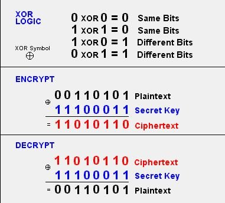
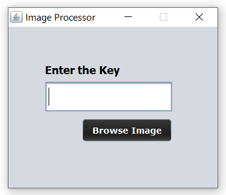

<h2>About</h2>
Image encryption can be defined in such a way that it is the process of encoding secret image with the help of some encryption algorithm in such a way that unauthorized users can't access it.

<h2>Swing (GUI) </h2>
Swing is a GUI widget toolkit for Java. It is part of Oracle's Java Foundation Classes (JFC) – an API for providing a graphical user interface (GUI) for Java programs.
<h4>For more</h4> https://www.geeksforgeeks.org/creating-frames-using-swings-java/

 <h2> AWT(Abstract Window Toolkit) </h2>
It is a platform dependent API for creating Graphical User Interface (GUI) for java programs.
<h4>For more</h4>https://www.javatpoint.com/java-awt

<h2>XOR encryption</h2>
XOR cipher employs the XOR logical operation in order to encrypt data. ... Then, XOR operation is performed using the key so that an encrypted data is created. In order to decrypt, the same key should be used and XOR operation should be run again. XOR operation uses the same key for both encryption and decryption. 

  

<h4>For more</h4>https://www.geeksforgeeks.org/xor-cipher/

<h1 align="center">Application Screenshot</h1>

  

